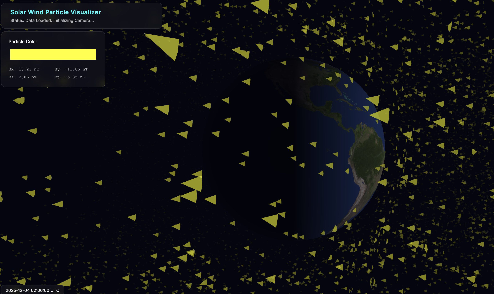

# CIRES Repository

This repository contains a small collection of files for data conversion and visualization.

## Files

- **`convert_nc_to_json.py`** – Python script that converts NetCDF files to JSON format.
- **`index.html`** – Simple HTML page that can be used to view visualizations.
- **`style.css`** – Stylesheet for the HTML page.
- **`data/`** – Directory for input data files.
- **`visuals/`** – Directory containing visual assets (e.g., `2k_earth_daymap.jpg`).

## Getting Started

1. **Clone the repository**

   ```bash
   git clone https://github.com/your-username/cires.git
   cd cires
   ```

2. **Run the Python conversion script**

   ```bash
   python3 convert_nc_to_json.py <input_file.nc> <output_file.json>
   ```

3. **Serve the HTML page locally (optional)**

   You can quickly view `index.html` using Python’s built‑in HTTP server:

   ```bash
   python3 -m http.server 8000
   ```

   Then open `http://localhost:8000` in your browser.

## Live Demo

The site is hosted at **[https://oneshin.pythonanywhere.com/](https://oneshin.pythonanywhere.com/)**. Visit the link to see the visualizations live.



## Contributing

Feel free to open issues or submit pull requests for improvements, new data formats, or additional visualizations.

## License

This project is provided under the MIT License. See the `LICENSE` file for details (if added later).

---

### Acknowledgements

Inspired by the work of [E. Huanglu](https://x.com/EHuanglu).

Data provided by **CIRES / NOAA** ([https://epic.gsfc.nasa.gov/](https://epic.gsfc.nasa.gov/)).

*Created with ❤️ for easy data conversion and visualization.*